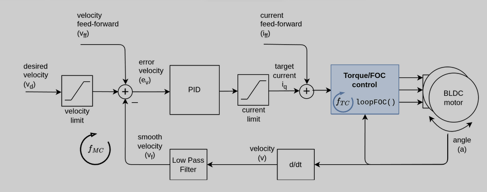
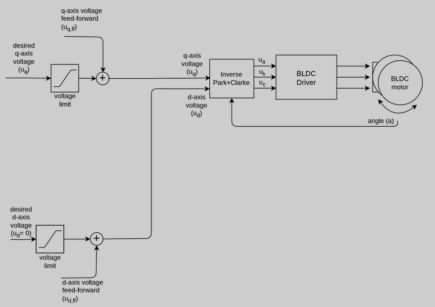

# Closed Loop FOC using STM32G431 and AS5600 Magnetic Encoder #

The project uses a 
1. B-G431-ESC1 evaluation board (STM32G431)
2. AS5600 Magnetic encoder
3. 7 Pole-Pair Gimbal BLDC motor

The software work with any of STM32 which can run at 168MHz or 170MHz. 16MHz won't be enough meet timing deadlines. 

Closed Loop FOC works by maintaining the stator magnetic field 90 apart from rotor magnetic field and controlling the voltage based on motor load to keep up the speed, just like a brushed DC motor except everything is controlled electronically. This will generate maximum torque possible at any given voltage and more efficiency unlike tradition variable frequency drives whose load angle varies and at different motor loads and is difficult to control. FOC can also give you very fine control if tuned properly.


## Velocity Control ##

*Velocity loop - Image Credits: SimpleFOC*
\
\
Feedforward is not implemented in the software.
1. The speed control loop runs at 1KHz, controlled by RCR bits in TIM1
2. AS5600 encoder works in Fast Mode - I2C(400KHz). It supports up to 1MHz, but advised not to use it unless you have designed your PCB and wires to tolerate EMI.


## Torque Control ##

\
*Torque loop - Image Credits: SimpleFOC* 

Torque loop won't measure or control any currents. To keep things simple, it is a voltage control method. You have to either implement current control or limit the current from the source.


## Setting Up ##
Make sure to add the third party folder to path in project settings in CubeIDE. Or else you can place all the .h files in inc and .c in src folders respectively, but not advised for clean freaks. 

1. Configure you PWM Frequency to 20KHz. Use Centre-aligned-Mode-1 counter. Don't use UP_COUNTER. 
2. Enable TIM1_Update_Interrupt. If you're using 6PWM, then make sure to add dead time under Break and Dead Time Management.
3. Verify your ISR frequency is 1KHz. For 20KHz PWM RCR of 39 will give 1KHz ISR.
4. Configure I2C to FastMode or 400KHz. 
5. USART is used to print status and scan user speed commands. My board uses USART2 via virtual COM port. You have to uses a USB to TTL converter if your board doesn't support virtual COM Port.
6. Configure the corresponding USART for you particular board. Make sure to add USART interrupt code inside STM32g4xx_it.c to your USARTx ISR.
7. Refer .ioc for any configuration settings references or you can check USART2_Init, not USART_init.
8. Make sure to disable "Generate IRQ Handler" for pendsv, Systick timer and System Service Call under SystemCore >> NVIC >> CodeGenration. These are already defined in FreeRTOS files.
9. As of now, calibrated encoder offset value is hardcoded. You can set debug_enable as true, then take the printed offset angles and calculate the average, then replace the hardcoded value with your value.
8. Also change the delay value in calibration inside closedloop.c >> Run_Calibration(). Now you're good to go!

```
	    MoveCommand = 1; // enable openloop inside ISR
	    vTaskDelay(pdMS_TO_TICKS(142)); 
        // Run for 142ms which is the time to cover 51.4 degree. 
        // Adjust this value using the equation delay_ts = 1000/PolePairs
	    MoveCommand = 0;
```

**While calibrating look out for offset angle crossing 0rad multiple times. For example, if your motor has 5 polepair, then there will be 5 calibration point and 4 points gave you value to 4 to 6rad, but 1 point went beyond 6.28rad(2PI) and gave 0.3rad. This can mess up your simple arithmetic average value (Arithmetic Averages Fail on Circles). So while taking average use a Sine/Cosine Averaging (Circular Mean) and then use atan2**

## Architecture Brief ##
The project uses FreeRTOS to switch between states and uses interrupt service routines ISRs to execute time sensitive motor control logic. 
\
Refer **main.c, stm32g4xx_it.c, closedloop.c, closedloop.h** for implementation.

### FreeRTOS ###
The system has 4 states: **Calibration, Open Loop, Closed Loop, Fault.** FreeRTOS only update the states. Open loop and closed loop are ran inside ISR. Calibration partially inside ISR. Fault will disable the interrupts, timers and PWM.

### TIM1 Update Interrupt ###
This will be triggered every UEV. TIM1 is configured to 20KHz, so ideally update should happen at same rate. But we have configured RCR bit using the equation $$f_{INT} = \frac{2 \times f_{PWM}}{RCR + 1}$$ which will trigger it only at 1KHz. All the motor control math, logic and data fetch should be completed under 1ms at 1KHz. My benchmarking has showed openloop and closed run inside ISR will be completed under 200us, 125us being consumed by blocking i2c transactions alone.This software is designed to meet strict timing deadlines. Changing timing parameters might break the algorithm. It is advised not to configure the control loop under 500us or 2KHz unless you're sure about what you're doing.

### Safety ##
I2c is implemented as a blocking code. Any delay in transaction greater than timeout or break in SDA SCL lines will trigger the FAULT_state which disable all the 6PWMs and disable the TIM1 ISR. This is to prevent high current flow, violent oscillations and heating of motor and inverter.

**Note: This software is intended for educational purposes. This is not production ready code. Practice caution while using the code.**
\
**Note: Use a current limited power source since there is no current control or over current protection implemented.**
\
**Note: 